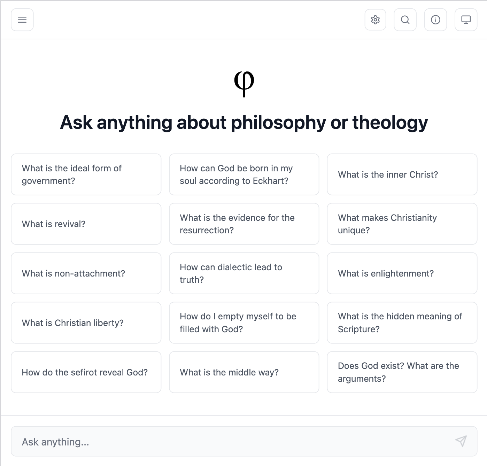

# Philosophizer

Agentic chat with tools and reasoning, using the wisdom of history's greatest philosophers and theologians.

Built with Bun, React, TypeScript, and PostgreSQL with pgvector for semantic search over primary source texts.

## Screenshots


_Conversational AI interface with philosophical wisdom_


_Semantic search over primary philosophical texts_

## Features

- **AI Agent**: Multi-model support with streaming responses and tool calling
- **RAG Search**: HQE (Hypothetical Question Embeddings) for improved semantic search over philosophical texts
- **Authentication**: Secure JWT-based user authentication
- **Conversations**: Save and manage chat history
- **Admin Panel**: Web interface for database management, backups, and Docker Hub integration
- **Modern Stack**: React 19, TailwindCSS 4, Vercel AI SDK v6, PostgreSQL 16 with pgvector

## Quick Start

**📖 See [SETUP.md](SETUP.md) for detailed installation instructions.**

```bash
# Install dependencies
bun install

# Copy environment variables
cp .env.example .env

# Start PostgreSQL with Docker
bun run postgres

# Start development server
bun run dev
```

Visit http://localhost:1738 to get started!

## Key Technologies

- **Runtime**: Bun
- **Frontend**: React 19, TypeScript, TailwindCSS 4
- **Backend**: Vercel AI SDK v6 (beta), Zod validation
- **Database**: PostgreSQL 16 with pgvector
- **RAG**: HQE (Hypothetical Question Embeddings)
- **Auth**: JWT with bcrypt
- **Markdown**: Streamdown (optimized for streaming)

## Development

```bash
# Development with hot reload
bun run dev

# Production
bun run start

# Debug mode
bun run dev:debug

# Docker Compose (all services)
docker compose up -d
```

## Admin Panel

Access the admin panel at `/admin` to manage:

- **Database Statistics**: View counts and sizes
- **RAG Management**: Re-index or clear philosopher texts
- **Backups**: Create, restore, and download backups
- **Docker Hub**: Publish and manage pre-loaded database images

Set admin access in `.env`:

```env
ADMIN_EMAILS=admin@example.com,another.admin@example.com
```

**📖 For detailed admin workflows (backups, Docker Hub publishing, etc.), see [SETUP.md](SETUP.md).**

## API Endpoints

**Authentication**

- `POST /auth/signup` - Create account
- `POST /auth/login` - Login
- `GET /auth/me` - Get current user

**Conversations**

- `GET /conversations` - List conversations
- `POST /conversations` - Create conversation
- `GET /conversations/:id` - Get conversation
- `PUT /conversations/:id` - Update conversation
- `DELETE /conversations/:id` - Delete conversation

**AI & RAG**

- `POST /agent` - Chat with AI agent
- `POST /rag` - Query philosophical texts
- `GET /rag` - Get RAG statistics

**Philosophers**

- `GET /api/philosophers` - List all philosophers
- `GET /api/philosophers/:id` - Get philosopher details

## RAG with HQE

This app uses **Hypothetical Question Embeddings (HQE)** for improved semantic search. For each text chunk:

1. Generates 3 hypothetical questions the chunk answers
2. Creates embeddings for both content and questions
3. Uses hybrid search (70% questions, 30% content) for better accuracy

```bash
# Index texts
bun run rag:index

# Clear and reindex
bun run rag:reset

# View statistics
bun run rag:stats
```

**📖 For detailed RAG workflows and embedding configuration, see [SETUP.md](SETUP.md).**

## Docker Hub Image

Pre-loaded PostgreSQL images with indexed philosopher texts are available on Docker Hub. These images include embeddings generated with specific models for compatibility.

**📖 For embedding model information and Docker Hub workflows, see [SETUP.md](SETUP.md).**

## License

MIT
